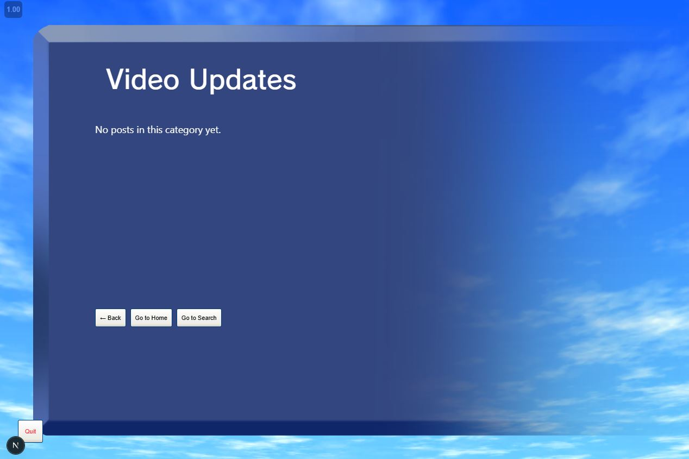

# Bug Report – Category with No Posts Shows Blank UI

## Summary
Selecting a blog category with no posts results in a blank UI with no feedback message, which may confuse users.

## Steps to Reproduce
1. Load site
2. Click Blog icon
3. Select a category that currently has no posts

## Expected Result
A message such as “No posts in this category yet.” is displayed to inform the user

## Actual Result
The screen appears empty or glitchy; no message or fallback UI is shown

## Severity
Low-Medium (affects user clarity and UX)

## Screenshot  

